<p align="center">
  <a href="https://github.com/w0rxbend/neoncore">
    
  </a>
</p>

<p align="center">
  <b>Sixteen pixels that tell you whether to open a window.</b><br>
  <sub>One byte in. Sixteen pixels out. A wireless ambient air-quality indicator for the AirGradient ONE — ESP32 · 4×4 WS2812B · TCP.</sub>
</p>

<p align="center">
  
  
  
  
  
  
  <a href="LICENSE"></a>
</p>

<p align="center">
  <a href="#-why-neoncore">Why</a> ·
  <a href="#-how-it-fits-together">How it fits</a> ·
  <a href="#-the-13-states">States</a> ·
  <a href="#-transitions">Transitions</a> ·
  <a href="#-build-one">Build one</a> ·
  <a href="#-quick-start">Quick start</a> ·
  <a href="#-troubleshooting">Troubleshooting</a> ·
  <a href="#-protocol">Protocol</a> ·
  <a href="#-connection-rules">Connections</a> ·
  <a href="#-discovery">Discovery</a> ·
  <a href="#-configuration">Configuration</a> ·
  <a href="#-architecture">Architecture</a> ·
  <a href="#-testing">Testing</a> ·
  <a href="#-tuning-knobs">Tuning</a> ·
  <a href="#-security-model">Security</a> ·
  <a href="#-license">License</a>
</p>

---

## ✨ Why neoncore

Your AirGradient ONE already knows the CO₂ and PM2.5 in the room. The problem is that it lives on one desk and its numbers need reading. **neoncore** is the glanceable half of that pair: a palm-sized 4×4 panel of glowing pixels you put on the shelf, the bedside table, the kitchen wall — anywhere you want a *feeling* for the air rather than a figure.

It is deliberately dumb in the right way. The device knows nothing about sensors or thresholds. A sender on your LAN (a Raspberry Pi script, Home Assistant, anything that can open a socket) reads the AirGradient's local API, maps the readings to one of **13 status codes**, and pushes a single byte over a tiny TCP contract. neoncore turns that byte into a distinct **colour + pattern + animation**, plays a wipe whenever the status changes, and wipes to a calm white-blue *standby* breath if the data ever stops.

| For | You get |
|:--|:--|
| **Users** | A BOM of five parts, one wire that matters, and a two-command flash. |
| **Integrators** | A 6–7 byte request, a 6-byte reply, an XOR checksum, no dependencies. A sender is ~15 lines of Python. The device can register itself with your registry, so you never hard-code its IP. |
| **Maintainers** | Hardware-free protocol, display and discovery-payload cores, 39 host-side Unity tests, a `loop()` that never blocks. |

> The sender (the "scraper" that talks to the AirGradient) is **out of scope** for this repo — neoncore is the display. `tools/` contains two reference clients so you can drive it from a laptop today.

---

## 🔭 How it fits together

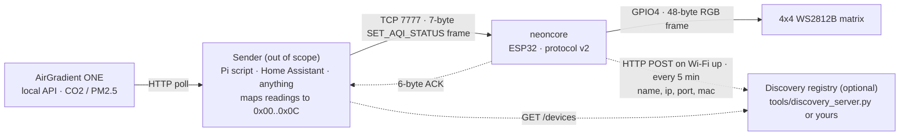

**The contract in one breath:** connect to TCP port **7777**, send `4C 4D 02 <cmd> <len> <payload…> <xor>`, read **6 bytes** back, check that byte 4 is `0x00`. Everything else in this README is detail.

---

## 🎨 The 13 states

<p align="center">
  
</p>

Sixteen LEDs, seven contract colours, six patterns — and every one of the 13 states is visually unique, which is verified by a test rather than promised. The visual language has three tiers. **Static** means the air is stable inside a band. **Breathing** means you are in the upper part of the band, approaching the next threshold. **Blink / alternating** means the situation is dangerous.

| Code | Name | Pattern | Colour | Animation |
|:--|:--|:--|:--|:--|
| `0x00` | Excellent | Inner 2×2 only | Green | Static |
| `0x01` | Good | Full | Green | Static |
| `0x02` | Good (degrading) | Full | Green | Breathing |
| `0x03` | Moderate | Full | Yellow | Static |
| `0x04` | Moderate (degrading) | Perimeter yellow + inner 2×2 orange | Dual | Inner breathing |
| `0x05` | Poor | Full | Orange | Static |
| `0x06` | Poor (degrading) | Full | Orange | Breathing |
| `0x07` | Unhealthy | Full | Red | Static |
| `0x08` | Unhealthy (degrading) | Full | Red | Breathing |
| `0x09` | Very Unhealthy | Full | Purple | Static |
| `0x0A` | Very Unhealthy (degrading) | Full | Purple | Breathing |
| `0x0B` | Hazardous | Full | Purple | Blink 500 ms |
| `0x0C` | Extreme | Full | Purple ↔ Red (220,0,0) | Alternating 300 ms |
| — | Standby | Full | White-blue (150,180,255) | Breathing |

**Contract colours** (RGB, before brightness scaling): green `(0,180,0)` · yellow `(255,210,0)` · orange `(255,100,0)` · red `(255,0,0)` · purple `(140,0,140)` · extreme's alternate red `(220,0,0)` · standby white-blue `(150,180,255)`.

**Animation timing.** Breathing walks a 16-step brightness table `{10,18,28,42,60,84,112,150,190,150,112,84,60,42,28,18}` (scaled /255) at 80 ms per step — a 1.28 s cycle that never goes fully dark and never hits full brightness (peak 190/255 ≈ 75 %). Blink toggles every 500 ms. Alternating swaps purple/red every 300 ms. Inner 2×2 = logical `x,y ∈ {1,2}`; perimeter = the other 12 pixels.

**Standby** has no wire code — it is what the device shows when it has nothing to say: at boot, and 60 s after the last accepted status.

<details>
<summary><b>Suggested sender-side thresholds</b> (CO₂ ppm · PM2.5 µg/m³) — the device never sees these numbers</summary>
<br>

The mapping is entirely the sender's business; this is the band table the reference tooling and docs use.

| Code | Name | CO₂ ppm | PM2.5 µg/m³ |
|:--|:--|--:|--:|
| `0x00` | Excellent | 0–400 | 0–2 |
| `0x01` | Good | 400–600 | 2–5 |
| `0x02` | Good (degrading) | 600–800 | 5–9 |
| `0x03` | Moderate | 800–1 000 | 9–15 |
| `0x04` | Moderate (degrading) | 1 000–1 250 | 15–25 |
| `0x05` | Poor | 1 250–1 500 | 25–35.4 |
| `0x06` | Poor (degrading) | 1 500–1 750 | 35.4–45 |
| `0x07` | Unhealthy | 1 750–2 000 | 45–55.4 |
| `0x08` | Unhealthy (degrading) | 2 000–2 500 | 55.4–75 |
| `0x09` | Very Unhealthy | 2 500–3 000 | 75–125 |
| `0x0A` | Very Unhealthy (degrading) | 3 000–4 000 | 125–200 |
| `0x0B` | Hazardous | 4 000–5 000 | 200–300 |
| `0x0C` | Extreme | > 5 000 | > 300 |

Pick the worse of the two pollutants, send the code. That is the whole sender. Keeping the bands sender-side means you can retune them without reflashing.
</details>

---

## 🎬 Transitions

<p align="center">
  
</p>

When the status **changes**, neoncore does not just swap colours:

| Phase | Duration | What is drawn |
|:--|:--|:--|
| **Wipe** | 16 × 40 ms = **640 ms** | The new primary colour is painted one LED at a time **over whatever frame was on screen when the transition began**, so a mid-breath fade or a half-finished blink is overwritten gracefully. Order: **top-right** corner first, leftwards along row 0, then rows 1..3 each right→left. The direction deliberately mirrors the AirGradient ONE's own LED bar. |
| **Hold** | **600 ms** | The full panel sits solid in the new primary colour — even for inner-only patterns like Excellent — so the change is unmistakable from across the room. |
| **Steady** | until the next change | The target pattern and animation begin at exactly **1 240 ms**. The pattern's clock starts at the end of the hold, so breathing always begins at the first table entry. |

Edge cases, all pinned by tests:

- **Same status repeated** while showing a status → *heartbeat*. The 60 s standby timeout is refreshed, nothing moves.
- **A different status arrives mid-transition** → the wipe restarts from the frame currently on screen; no flash back to the old colour.
- **Return to standby** (60 s without a status) is itself a transition — a wipe to white-blue.
- **The first status after standby always animates**, even if it is the same code as before the timeout.
- `Display::begin()` enters standby immediately with no transition.

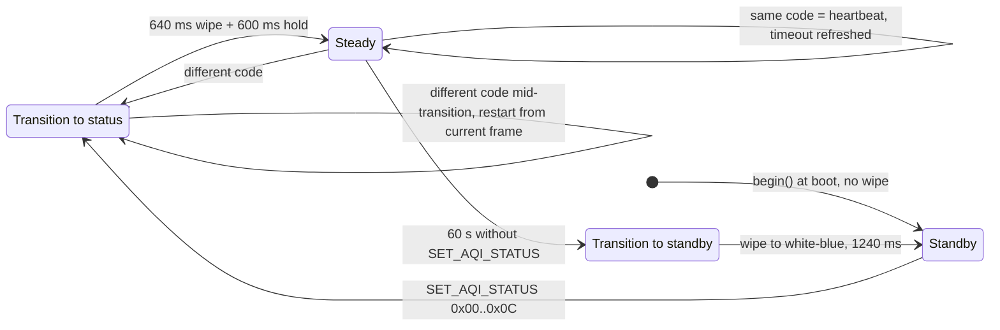

---

## 🔧 Build one

<p align="center">
  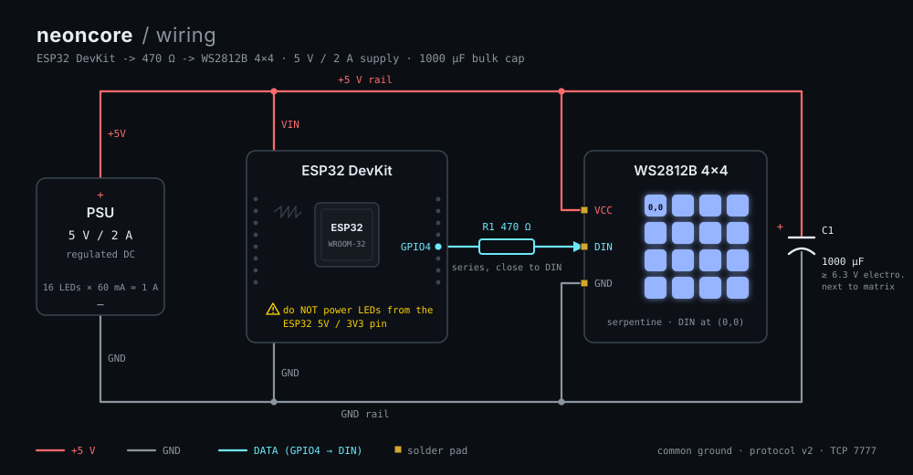
</p>

### Bill of materials

| Qty | Part | Notes |
|:--|:--|:--|
| 1 | ESP32 DevKit v1 (WROOM32) | Any 30- or 38-pin variant; PlatformIO board `esp32dev` |
| 1 | WS2812B 4×4 LED matrix | 16 pixels, 5 V, serpentine wiring, DIN at logical (0,0) |
| 1 | 5 V / 2 A power supply | Shared by the ESP32 and the LEDs |
| 1 | 470 Ω resistor | In series with the data line |
| 1 | 1 000 µF capacitor | Across the LED power rails (recommended) |

### Wiring

| From | To |
|:--|:--|
| Supply **+5 V** | WS2812B **VCC** |
| Supply **GND** | WS2812B **GND** **and** ESP32 **GND** (common ground) |
| ESP32 **GPIO4** | 470 Ω → WS2812B **DIN** |

> [!WARNING]
> Do **not** power the matrix from the ESP32's 3.3 V or 5 V pin. Sixteen WS2812Bs at full brightness can draw more than 900 mA. Give them their own rail; the default brightness of 40/255 keeps the average draw modest, but the peaks are what kill regulators.

### Serpentine layout

Logical `(0,0)` is the top-left pixel. Physical wiring is serpentine: even rows run left→right (`index = y*4 + x`), odd rows right→left (`index = y*4 + (3 - x)`); out-of-range coordinates map to `16` (= `kLedCount`, a safe no-op index).

```
logical x →   0   1   2   3
row 0       [ 0][ 1][ 2][ 3]  →
row 1       [ 7][ 6][ 5][ 4]  ←
row 2       [ 8][ 9][10][11]  →
row 3       [15][14][13][12]  ←
```

`include/MatrixLayout.h` is the only place this knowledge exists; both the renderer and the LED driver import it, so if your panel is wired differently that is the single file to change.

**Brown-out detector:** disabled by default (`kDisableBrownoutDetector = true`), because cheap USB supplies plus Wi-Fi TX bursts trip it constantly. The trade-off is that a genuinely sagging supply corrupts state instead of resetting — fix your power, don't rely on the detector.

---

## 🚀 Quick start

You need [PlatformIO](https://platformio.org/) (CLI or the VS Code extension — `.vscode/extensions.json` recommends it).

### 1 · Credentials

```bash
git clone https://github.com/w0rxbend/neoncore.git
cd neoncore
cp include/creds.example.h include/creds.h
```

Edit `include/creds.h` — at minimum `WIFI_SSID` and `WIFI_PASSWORD`. The file is git-ignored. Static IP, MAC override, AP password and a boot-time network scan are all optional; see [Configuration](#-configuration).

### 2 · Flash

```bash
pio run                   # build (default env: esp32dev)
pio run --target upload   # flash over USB
```

### 3 · Verify

```bash
pio device monitor        # 115200 baud
```

A healthy boot looks like this — the lines are exact strings from the firmware, so you can grep for them:

```
neoncore ESP32 WS2812B AQI indicator
Firmware: 0.3.0
Protocol version: 2
LED data pin: GPIO4
Matrix: 4x4
Boot settle delay ms: 2000
Startup animation: running
MAC: A4:CF:12:34:56:78
Target SSID: "your-wifi-ssid"
Connecting to Wi-Fi (non-blocking)
Wi-Fi connected
Device IP: 192.168.1.100
TCP server started on 192.168.1.100:7777
Discovery: disabled (DISCOVERY_URL not set)
```

With a registry configured the last line becomes `Discovery: enabled, service http://…` followed shortly by `Discovery: registered neoncore-3ce903 at 192.168.1.100 (HTTP 200)`.

What the panel does meanwhile: a 2 s settle delay → a short blocking startup sweep (a single white pixel crosses the 16 LEDs twice at 35 ms/step, a 180 ms green fill, an 80 ms clear — about 1.5 s) → the white-blue **standby breath**. Standby begins as soon as the sweep finishes, *before* Wi-Fi is up; the Wi-Fi connect itself is non-blocking and retries `WiFi.begin()` every 15 s (`Wi-Fi not connected, retrying`) until it succeeds. The display never waits for the network.

### 4 · Drive it

Both tools are Python 3, standard library only.

```bash
# one-shot commands (fresh connection per call, exit code 0 = OK)
python3 tools/client.py --host 192.168.1.100 ping                 # health check, display untouched
python3 tools/client.py --host 192.168.1.100 aqi moderate_degrading
python3 tools/client.py --host 192.168.1.100 aqi 0x0C             # by code, decimal or hex
python3 tools/client.py --host 192.168.1.100 brightness 80        # 0–255, default 40, not persisted
python3 tools/client.py --host 192.168.1.100 panel off            # blank LEDs, keep state

# tour all 13 states on one persistent connection, 3 s each
python3 tools/aqi_example.py --host 192.168.1.100 --hold 3
```

`client.py` accepts status names (`excellent`, `good`, `good_degrading`, `moderate`, `moderate_degrading`, `poor`, `poor_degrading`, `unhealthy`, `unhealthy_degrading`, `very_unhealthy`, `very_unhealthy_degrading`, `hazardous`, `extreme`) or numeric codes. It validates the 6-byte reply's header and checksum and prints `  -> OK` (or the error status name). Exit codes: `0` OK, `2` non-OK status or malformed reply, `1` connection error — handy for shell scripts. `aqi_example.py` keeps one connection open and walks `0x00 → 0x0C` so you can watch the transition between every pair of states.

> [!TIP]
> The two tools ship with different default hosts (`client.py` → `192.168.1.100`, `aqi_example.py` → `192.168.1.192`). Always pass `--host`.

Now prove the loop end-to-end from another machine:

```bash
python3 tools/client.py --host 192.168.1.100 aqi extreme
#   -> OK
```

and watch the serial monitor print one line per command:

```
TCP client connected from 192.168.1.50
Instruction: SET_AQI_STATUS (0x3), len=1, from 192.168.1.50:51234 -> OK
TCP client dropped: peer closed
```

(The command id is printed unpadded — `0x3`, not `0x03` — so grep for `(0x3)`.)

Sixty seconds later, with no further status, you will see `AQI data timeout, returning to standby` and the matrix wipes back to white-blue.

<details>
<summary><b>Every serial log line the firmware can print</b></summary>
<br>

| Line | When |
|:--|:--|
| `neoncore ESP32 WS2812B AQI indicator` · `Firmware: 0.3.0` · `Protocol version: 2` · `LED data pin: GPIO4` · `Matrix: 4x4` · `Boot settle delay ms: 2000` | Banner, immediately after reset |
| `Startup animation: running` | After the settle delay, before the sweep |
| `MAC: XX:XX:XX:XX:XX:XX` | Wi-Fi start (uppercase hex, after `WIFI_MAC_OVERRIDE` if any) |
| `MAC override failed, esp_err=<n>` | `esp_wifi_set_mac()` rejected the override |
| `Static IP: <ip>` | Only if `STATIC_IP` / `STATIC_GATEWAY` / `STATIC_SUBNET` are set |
| `Static IP config is invalid, falling back to DHCP` | One of the static strings did not parse |
| `WiFi.config() failed, falling back to DHCP` | The stack rejected the static config |
| `Target SSID: "<ssid>"` | Station mode |
| `Scanning for networks...` / `No networks found` / `  [n] SSID: "…"  RSSI: … dBm  CH: …  ENC: open\|secured` | Only with `WIFI_SCAN_ON_BOOT 1` |
| `Connecting to Wi-Fi (non-blocking)` | Station mode |
| `AP SSID (WPA2): led-matrix` / `AP SSID (open): led-matrix` | AP mode (only when `WIFI_SSID` is empty) |
| `WIFI_AP_PASSWORD is shorter than 8 characters, starting an open AP` | AP password 1–7 chars |
| `Wi-Fi connected` / `Wi-Fi disconnected` | Link state changes |
| `Wi-Fi not connected, retrying` | Every 15 s until connected |
| `Device IP: <ip>` | After link up |
| `TCP server started on <ip>:7777` / `TCP server stopped` | Server lifecycle |
| `TCP client connected from <ip>` | Accept |
| `TCP client dropped: <reason>` | `replaced by new connection`, `peer closed`, `idle timeout`, `server stopping` |
| `Partial frame timed out, parser reset` | Half a frame, then 2 s of silence |
| `Discovery: enabled, service <url>` / `Discovery: disabled (DISCOVERY_URL not set)` | Once at startup, station mode only |
| `Discovery: registered <name> at <ip> (HTTP <code>)` | Each successful registration: link up, then every 5 min |
| `Discovery: registration failed (<reason>), retry in 30 s` | Connection refused, timeout, non-2xx, etc. |
| `Discovery: DISCOVERY_URL is https but DISCOVERY_HTTPS is not defined` · `Discovery: invalid DISCOVERY_URL` · `Discovery: payload does not fit, check DISCOVERY_DEVICE_NAME length` · `Discovery: failed to start worker task, registration disabled` | Configuration problems |
| `Instruction: <NAME> (0x<hex>), len=<n>, from <ip>:<port> -> <STATUS>` | Every command (`PING`, `SET_BRIGHTNESS`, `SET_PANEL_ENABLED`, `SET_AQI_STATUS`, `UNKNOWN`). The hex id is unpadded: `(0x0)`, `(0x1)`, `(0x3)`. |
| `AQI data timeout, returning to standby` | 60 s without a status |
</details>

---

## 🩺 Troubleshooting

Sixteen pixels can only fail in so many ways. The serial monitor (`pio device monitor`, 115200 baud) is the first place to look — the panel itself says nothing about the network.

| Symptom | Cause / what to check |
|:--|:--|
| Serial prints `Wi-Fi not connected, retrying` every 15 s, panel breathes white-blue forever | Wrong `WIFI_SSID` / `WIFI_PASSWORD`, a 5 GHz-only SSID (the ESP32 is 2.4 GHz only), or out of range. Set `WIFI_SCAN_ON_BOOT 1` to confirm the SSID is visible and read its RSSI. There is **no AP fallback** — the firmware retries station mode forever. |
| Serial prints `AP SSID (open): led-matrix` although you set an SSID | `include/creds.h` is missing or not being included, so `WIFI_SSID` defaulted to `""` and the build silently became an access point. Check `cp include/creds.example.h include/creds.h`, that the file lives in `include/`, then rebuild. |
| Boots and connects, but you don't know the IP | There is no mDNS (`neoncore.local` will not resolve). Read `Device IP:` from the serial monitor, look in your router's DHCP lease table (the `MAC:` line helps), or set `STATIC_IP`. `WIFI_MAC_OVERRIDE` plus a DHCP reservation keeps the address stable across boards. |
| No LEDs at all | Common ground missing between supply and ESP32; data wire on the wrong end of the strip (DIN, not DOUT); wrong pin (`LED_PIN` default GPIO4). The startup sweep runs *before* Wi-Fi, so if nothing lights in the first ~4 s the problem is wiring or power, not network. |
| Random flicker, wrong colours, first LED stuck | WS2812B wants ~3.5 V logic at 5 V VDD and the ESP32 drives 3.3 V. Keep the data wire short, use the 470 Ω resistor, and if it persists add a 74AHCT125 level shifter or drop the LED supply to ~4.5 V. If red and green are swapped, your panel is not GRB — change `NEO_GRB` in `src/LedMatrixController.cpp`. |
| Panel freezes on one colour, or random reboots | Supply sag. The brown-out detector is disabled (`kDisableBrownoutDetector`), so a weak supply corrupts state instead of resetting. Use the separate 5 V / 2 A rail. |
| `pio run --target upload` fails to open the port | Linux: add yourself to `dialout` / `uucp` and log in again, or pass `--upload-port /dev/ttyUSB0`. Some DevKit v1 boards need BOOT held while flashing starts. |
| `python3 tools/client.py …` prints `Connection error: [Errno 111] Connection refused` | Wrong `--host` (the two tools have different defaults — always pass it), or the TCP server isn't up yet: it starts only after `TCP server started on …` appears on serial, and it stops while Wi-Fi is down. |
| Client prints `Connection error: timed out` | Device is on another subnet / VLAN, or the panel rebooted. `ping` the IP first. |
| `-> INVALID_ARGUMENT` | AQI code > `0x0C`. Names are lowercase snake_case (`moderate_degrading`, not `Moderate (degrading)`); `client.py aqi 13` is rejected by the device, not the tool. |
| `-> BAD_MAGIC` streams back for every byte | You are typing into `nc` / telnet, or your sender forgot the `4C 4D` prefix or sends text. Every stray byte outside a frame is answered with `BAD_MAGIC`. |
| `-> INVALID_LENGTH` | Wrong length byte for the command: `PING` must be 0, the other three exactly 1. |
| Persistent sender gets `connection closed before response` or a reset | Another client connected (newest wins), 90 s passed without a complete frame, or Wi-Fi dropped (`server stopping`). Reconnect and resend. |
| Panel goes back to white-blue after a minute | Expected: 60 s without `SET_AQI_STATUS`. `PING` does **not** count. Resend the status (same code = heartbeat). |
| Standby breathing but nothing responds on 7777 | Standby says nothing about the network — it starts before Wi-Fi is up and keeps running if Wi-Fi never connects. Only the serial log shows link state. |
| `Discovery: registration failed (connection refused)` every 30 s | Registry not running, wrong host/port in `DISCOVERY_URL`, or a firewall. Start `tools/discovery_server.py` and `curl -X POST` it from a laptop first. |
| `Discovery: registration failed (HTTP 401)` | Registry wants a bearer token: set `DISCOVERY_TOKEN` to match (`--token` on the reference server). |
| `Discovery: registration failed (HTTP 404)` | `DISCOVERY_URL` must include the path — `/register` on the reference server — not just the host. |
| Device registers but the sender still can't connect | The registered `ip` is what the ESP32 sees on its own interface. If the registry and the sender are on a different VLAN or behind NAT, they need a route to it. Check `GET /devices` shows the IP you expect. |
| `Discovery: DISCOVERY_URL is https but DISCOVERY_HTTPS is not defined` | TLS is opt-in to save ~125 KB of flash. Add `#define DISCOVERY_HTTPS 1` to `creds.h`, or use a plain `http://` registry on the LAN. |

---

## 📡 Protocol

**The contract in one breath:** connect to TCP port **7777**, send `4C 4D 02 <cmd> <len> <payload…> <xor>`, read **6 bytes** back, check that byte 4 is `0x00`.

<p align="center">
  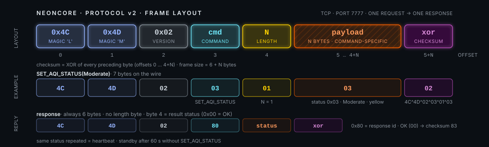
</p>

Protocol **v2** is intentionally tiny: a fixed 5-byte header, an optional payload, and a 1-byte XOR checksum. Four commands, one response shape. It is documented in full in [`docs/protocol.md`](docs/protocol.md), which is normative.

### Frame

| Offset | Field | Value |
|:--|:--|:--|
| 0 | Magic 0 | `0x4C` (`'L'`) |
| 1 | Magic 1 | `0x4D` (`'M'`) |
| 2 | Version | `0x02` — anything else is rejected with `UNSUPPORTED_VERSION` |
| 3 | Command | see below |
| 4 | Payload length | 0–255 |
| 5 … 4+N | Payload | N bytes |
| 5+N | Checksum | XOR of every preceding byte (integrity only, not cryptographic) |

Maximum frame is 5 + 255 + 1 = **261 bytes**; the smallest (`PING`) is 6. Frames may be **pipelined** on one connection and are answered in order.

### Commands

| ID | Command | Payload | Effect | Errors |
|:--|:--|:--|:--|:--|
| `0x00` | `PING` | none (length must be 0) | Reply `OK`. Display untouched. Refreshes the 90 s client idle timer — but **not** the 60 s AQI standby timeout. | `INVALID_LENGTH` if len ≠ 0 |
| `0x01` | `SET_BRIGHTNESS` | 1 byte, 0–255 | Global brightness. Default **40**. Not persisted across reboot. Re-renders from the stored frame so colours don't degrade. | `INVALID_LENGTH` |
| `0x02` | `SET_PANEL_ENABLED` | 1 byte, `0` = off, non-zero = on | Blanks the LEDs while keeping the frame buffer; animations keep running underneath and reappear on enable. | `INVALID_LENGTH` |
| `0x03` | `SET_AQI_STATUS` | 1 byte, `0x00`–`0x0C` | The one you care about. Resets the standby timeout; a **changed** code plays the transition; the **same** code is a heartbeat with no animation. | `INVALID_LENGTH`; `INVALID_ARGUMENT` if > `0x0C` |
| other | — | not checked | — | `UNKNOWN_COMMAND` (payload length not checked) |

### Response — always exactly 6 bytes

```
4C 4D 02 80 <status> <xor>      e.g. OK → 4C 4D 02 80 00 83
```

`0x80` is the response command id. A response is emitted after **every** command and for **every** parser error, so a sender can always `recv(6)` after `sendall()`.

| Status | Name | Meaning | Raised by |
|:--|:--|:--|:--|
| `0x00` | `OK` | Frame valid, command applied | dispatch, whole frame consumed |
| `0x01` | `BAD_MAGIC` | First two bytes are not `'L'`,`'M'` — sent for every stray byte while no frame is in progress | parser, mid-frame resync |
| `0x02` | `UNSUPPORTED_VERSION` | Version byte ≠ `0x02` | parser, mid-frame resync |
| `0x03` | `UNKNOWN_COMMAND` | Header valid, command id not implemented | dispatch, whole frame consumed |
| `0x04` | `INVALID_LENGTH` | Payload length wrong for the command | dispatch, whole frame consumed |
| `0x05` | `CHECKSUM_MISMATCH` | XOR failed | parser, mid-frame resync |
| `0x06` | `INVALID_ARGUMENT` | Length right, value outside the contract (e.g. AQI code `0x0D`) | dispatch, whole frame consumed |

Whatever the status, the parser is back at byte 0 after every response — the very next byte is treated as a possible new `0x4C`. The difference is *when*: framing errors (`0x01`, `0x02`, `0x05`) abort the frame at the offending byte, while dispatch errors (`0x03`, `0x04`, `0x06`) are raised only after a complete, checksum-valid frame has been read. One subtlety worth knowing if you fuzz it: on a bad *second* magic byte the offending byte is discarded, not re-examined as a candidate first magic byte.

### A `SET_AQI_STATUS` exchange

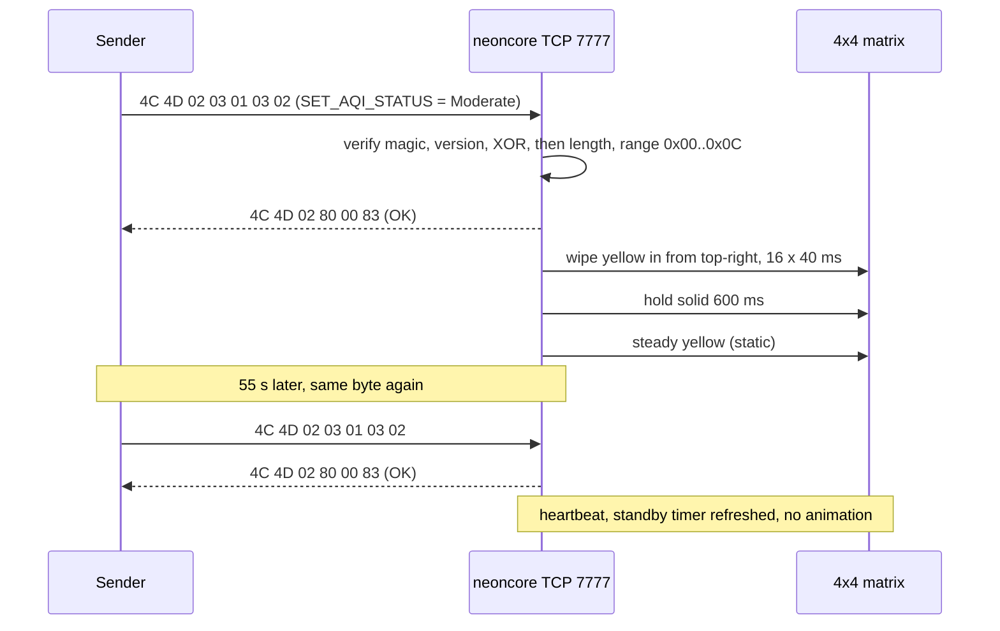

### A sender in 15 lines

```python
import socket

def frame(cmd: int, payload: bytes = b"") -> bytes:
    body = bytes([0x4C, 0x4D, 0x02, cmd, len(payload)]) + payload   # 'L' 'M' v2 cmd len
    xor = 0
    for b in body:
        xor ^= b
    return body + bytes([xor])                                        # 1-byte XOR checksum

def send_status(host: str, code: int, port: int = 7777) -> bool:
    with socket.create_connection((host, port), timeout=5) as s:
        s.setsockopt(socket.IPPROTO_TCP, socket.TCP_NODELAY, 1)
        s.sendall(frame(0x03, bytes([code])))                          # SET_AQI_STATUS
        reply = s.recv(6)                                             # 4C 4D 02 80 <status> <xor>
    return len(reply) == 6 and reply[:4] == b"\x4C\x4D\x02\x80" and reply[4] == 0x00

print(send_status("192.168.1.100", 0x03))   # Moderate (yellow) -> True on OK
```

> Two things the 15-line version glosses over, both handled by `tools/client.py`: **read to length** — TCP does not preserve message boundaries, so on a long-lived connection loop on `recv()` until you hold 6 bytes (`recv_exact` in `aqi_example.py`); and **always set a socket timeout** (the sample uses 5 s) — the device replies within one `loop()` pass, so anything slower means it is gone and you should reconnect rather than block your poller. If you pipeline N frames, read 6 × N bytes; replies come back in order.

That exact frame on the wire is `4C 4D 02 03 01 03 02`; the ACK is `4C 4D 02 80 00 83`. Send the same code again every ≤ 60 s as a heartbeat and the display stays put; send a different one and the new colour wipes in from the top-right corner. Wrap it in a loop that polls the AirGradient's local API every minute and you have a sender. For a fuller reference with all four commands, named statuses and exit codes, read [`tools/client.py`](tools/client.py).

---

## 🔌 Connection rules

neoncore is a single-client device that expects to be talked to regularly. Every rule is a constant in `include/AppConfig.h` or a small method in `TcpMatrixServer` (names as of the current source).

| Rule | Value | What it means for your sender | Where |
|:--|:--|:--|:--|
| Clients | **one**, newest wins | A new connection drops the existing one (`TCP client dropped: replaced by new connection`) before it is accepted. Don't run two senders. | `acceptClientIfPending()` |
| Client idle timeout | **90 s** | Dropped (`idle timeout`) if no *complete* frame arrives for 90 s. Bytes alone don't count. Send a `PING` or a status at least that often on a persistent connection. | `kClientIdleTimeoutMs` |
| AQI standby timeout | **60 s** | Measured from the last accepted `SET_AQI_STATUS`. `PING` does **not** refresh it. Push a status at least once a minute or the display wipes to standby. | `kAqiStandbyTimeoutMs` |
| Partial-frame timeout | **2 s** | A half-frame with no new byte for 2 s resets the parser (`Partial frame timed out, parser reset`); the connection stays up. | `kFrameTimeoutMs` |
| TCP keepalive | idle 10 s · interval 5 s · count 3 | A vanished peer (Wi-Fi drop, yanked cable) is detected in ≈ 10 + 5 × 3 = 25 s and the socket freed. | `enableKeepAlive()` |
| Per-loop read budget | **256 bytes** | A chatty client cannot starve the animation engine. A max-size 261-byte frame spans ≥ 2 loop passes — harmless. | `kMaxClientBytesPerLoop` |
| Nagle | off on the device | The firmware calls `setNoDelay(true)` on its own sockets; set `TCP_NODELAY` on your side too (both tools and the 15-line sender do) so small frames go out immediately. | `startServer()` / accept |
| Peer close | — | Logged as `TCP client dropped: peer closed`. | `readClientBytes()` |
| Wi-Fi loss | — | Server stopped, client dropped with `server stopping`; the server restarts when the link returns. Reconnect when the device reappears. | `updateWifi()` |

Both styles work: **connect-per-update** (open, send, read 6 bytes, close — what `client.py` does) and a **persistent connection** (what `aqi_example.py` does).

> [!IMPORTANT]
> There is no authentication or encryption. Keep port 7777 on your LAN. See [Security model](#-security-model).

---

## 📍 Discovery

DHCP addresses move. Rather than pinning a static IP on every device, let neoncore announce itself: set `DISCOVERY_URL` in `creds.h` and, every time Wi-Fi comes up, the device POSTs one small JSON document to your registry. Your sender asks the registry where the device is and connects.

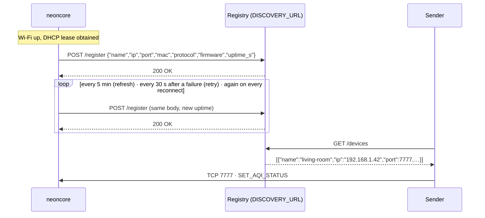

**What is sent** — one line of JSON, `Content-Type: application/json`, plus `Authorization: Bearer …` when `DISCOVERY_TOKEN` is set:

```json
{"name":"living-room","ip":"192.168.1.42","port":7777,"mac":"CC:50:E3:3C:E9:03","protocol":2,"firmware":"0.3.0","uptime_s":4242}
```

| Field | Meaning |
|:--|:--|
| `name` | `DISCOVERY_DEVICE_NAME`, or `neoncore-` + the last three MAC bytes in lowercase hex (`neoncore-3ce903`). The registry's key. |
| `ip` · `port` | Where to open the TCP contract. `ip` is the address DHCP handed out; `port` is `kTcpPort` (7777). |
| `mac` | Stable across reboots and DHCP renewals; useful as a secondary key. |
| `protocol` | Wire protocol version (2). A sender can refuse devices it doesn't speak. |
| `firmware` | `kFirmwareVersion`. |
| `uptime_s` | Seconds since boot, so a registry can spot reboots. |

**When it is sent** — immediately on link up (after DHCP), then every 5 minutes as a keep-alive so the registry can expire devices that vanished, and every 30 seconds after a failure. A Wi-Fi drop clears the registered state and the next link-up registers again, which is what makes a changed DHCP address harmless. Any 2xx reply is success; anything else, including a timeout, is logged and retried.

**It never blocks the display.** The HTTP call runs on its own FreeRTOS task. The main loop only decides *when* to register and pokes the task; a slow or dead registry costs nothing but a log line every 30 s.

**Reference registry** — `tools/discovery_server.py` is a standard-library Python service that does exactly what the diagram shows, with an optional bearer token and a 15-minute TTL:

```bash
python3 tools/discovery_server.py --port 8787              # add --token SECRET to require DISCOVERY_TOKEN
curl -s http://localhost:8787/devices                       # every live device
curl -s http://localhost:8787/devices/living-room           # one by name
```

Then in `creds.h`:

```cpp
#define DISCOVERY_URL         "http://192.168.1.10:8787/register"
#define DISCOVERY_DEVICE_NAME "living-room"      // optional
#define DISCOVERY_TOKEN       "SECRET"           // optional
```

Any HTTP endpoint that accepts a JSON POST works just as well — a Home Assistant webhook, a tiny Flask route, an n8n flow. HTTPS is supported but opt-in (`#define DISCOVERY_HTTPS 1`) because the TLS stack costs a further ~125 KB of flash on top of the ~175 KB the HTTP client already adds; certificate validation is disabled, so treat it as obfuscation on a LAN, not security.

> Discovery is a convenience for *finding* the device. It is not part of the TCP contract: a device with `DISCOVERY_URL` unset behaves identically on port 7777, and nothing about it is compiled in.

---

## ⚙ Configuration

All options are `#define`s in `include/creds.h` (copied from `include/creds.example.h`, git-ignored, pulled in through `#if __has_include("creds.h")`). Unset options take the defaults from `AppConfig.h`. Only `WIFI_SSID` and `WIFI_PASSWORD` are needed for a normal install — and if even those are left empty, the device starts an access point instead. Note that a missing `creds.h` is **not a build error** — `AppConfig.h` includes it only `#if __has_include("creds.h")`, so without the file the firmware silently builds with an empty SSID and boots as the open access point `led-matrix`. If the serial banner says `AP SSID (open): led-matrix` when you expected station mode, that is why.

| Define | Default | Effect |
|:--|:--|:--|
| `WIFI_SSID` | `""` | Station SSID. **Empty → AP mode** (see below). |
| `WIFI_PASSWORD` | `""` | Station password. |
| `STATIC_IP` · `STATIC_GATEWAY` · `STATIC_SUBNET` | unset | All three required to skip DHCP. Invalid strings or a failed `WiFi.config()` fall back to DHCP with a log line. |
| `STATIC_DNS` | gateway | Optional; only used with the three above. |
| `WIFI_MAC_OVERRIDE` | unset | Six-byte initialiser, e.g. `{0x02,0xAA,0xBB,0xCC,0xDD,0xEE}`. Applied via `esp_wifi_set_mac(WIFI_IF_STA, …)`. Use a locally-administered address (second hex digit 2/6/A/E). Useful for DHCP reservations that survive swapping boards. |
| `WIFI_AP_PASSWORD` | `""` | AP mode only. ≥ 8 chars → WPA2. 1–7 chars → warning and an **open** AP. Empty → open AP. |
| `WIFI_SCAN_ON_BOOT` | `0` | `1` lists SSID / RSSI / channel / encryption on serial at boot. Adds a few seconds. |
| `LED_PIN` | `4` | WS2812B data pin (GPIO4). |
| `DISCOVERY_URL` | unset | Registry endpoint to POST the device's address to on every Wi-Fi link-up and every 5 min. Unset → nothing compiled in. See [Discovery](#-discovery). |
| `DISCOVERY_TOKEN` | `""` | Sent as `Authorization: Bearer …` with each registration. |
| `DISCOVERY_DEVICE_NAME` | `""` | Registry key. Empty → `neoncore-<last 3 MAC bytes>`. Max ~40 chars; longer names are rejected at boot with a log line. |
| `DISCOVERY_HTTPS` | unset | Define to `1` to link TLS for an `https://` registry (+~125 KB flash, no certificate validation). |

<details>
<summary><b>Access-point mode, and what "AP fallback" does and doesn't mean</b></summary>
<br>

- If `WIFI_SSID` is empty the device starts its own network, SSID **`led-matrix`**, and prints the AP IP (`WiFi.softAPIP()`). Connect to it and talk to port 7777 as usual — handy for bench testing without a router.
- The access point is used **only when `WIFI_SSID` is empty**. It is *not* a fallback for a failed station connection: with an SSID configured the firmware retries `WiFi.begin()` every 15 s forever and never switches to AP. If you want that behaviour, `updateWifi()` in `TcpMatrixServer.cpp` is where a retry counter would go.
- Station mode runs with Bluetooth stopped (`btStop()`), `WiFi.persistent(false)` so credentials stay out of the ESP32's Wi-Fi flash storage, `WiFi.setAutoReconnect(true)`, `WiFi.mode(WIFI_STA)`, then a **non-blocking** `WiFi.begin()` — the standby breath keeps running while the link comes up.
- Brightness set over TCP is not persisted; there is no NVS code.
</details>

---

## 🏗 Architecture

For maintainers. The codebase is split along one hard line: **everything with logic worth testing compiles on the host without Arduino**, and everything that touches hardware is a thin adapter. The three hardware-free modules — the wire protocol, the visual contract and the discovery payload — carry all 39 tests and almost all of the logic.

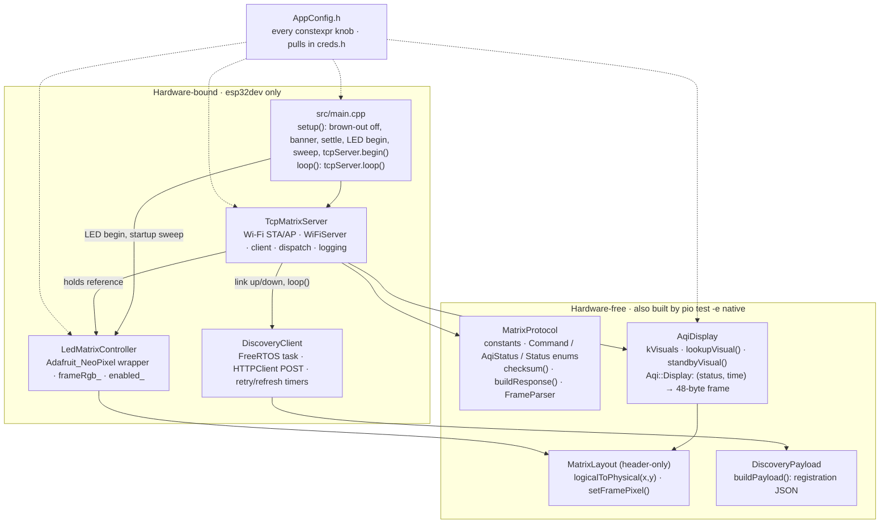

### Module map

| Module | Files | Responsibility | Hardware-free? |
|:--|:--|:--|:--|
| **AppConfig** | `include/AppConfig.h` | Every tunable as a `constexpr` in `namespace AppConfig`: pin, matrix size, brightness, boot delay, brown-out flag, TCP port, AP SSID, Wi-Fi retry, client/frame timeouts, keepalive, AQI timings. Pulls in `creds.h`. | ✓ |
| **MatrixProtocol** | `include/MatrixProtocol.h` · `src/MatrixProtocol.cpp` | The wire contract: constants, `Command` / `AqiStatus` / `Status` enums, `checksum()`, `buildResponse()`, and the byte-at-a-time `FrameParser` (`push()` → `kNeedMore` / `kFrameReady` / `kError`). | ✓ |
| **AqiDisplay** | `include/AqiDisplay.h` · `src/AqiDisplay.cpp` | The visual contract: `kVisuals` table, `lookupVisual()`, `standbyVisual()`, and `Aqi::Display`, which turns (status, time) into a 48-byte physical-order RGB frame including transitions, breathing, blink, alternate, dual-zone and the standby timeout. | ✓ |
| **MatrixLayout** | `include/MatrixLayout.h` | Header-only serpentine mapping: `logicalToPhysical(x, y)` and `setFramePixel()`. Shared by the renderer and the LED driver so they can never disagree. | ✓ |
| **DiscoveryPayload** | `include/DiscoveryPayload.h` · `src/DiscoveryPayload.cpp` | `buildPayload()`: the registration JSON (`name`, `ip`, `port`, `mac`, `protocol`, `firmware`, `uptime_s`) with proper string escaping and a hard capacity check. Pinned byte-for-byte by tests. | ✓ |
| **DiscoveryClient** | `include/DiscoveryClient.h` · `src/DiscoveryClient.cpp` | Registers with `DISCOVERY_URL`. The main loop schedules (link-up, 5 min refresh, 30 s retry) and notifies a FreeRTOS task; the task snapshots IP/MAC, builds the payload, and does the blocking `HTTPClient` POST. Compiled to a no-op without `DISCOVERY_URL`. | ✗ |
| **LedMatrixController** | `include/LedMatrixController.h` · `src/LedMatrixController.cpp` | Thin Adafruit_NeoPixel wrapper (`NEO_GRB + NEO_KHZ800`): `begin` / `clear` / `setBrightness` / `setEnabled` / `fill` / `setPixel` / `setPhysicalFrame`. Keeps its own `frameRgb_` so `setBrightness` re-renders from the stored colours and NeoPixel's lossy brightness scaling never accumulates. Disabled → writes black, keeps the frame. | ✗ |
| **TcpMatrixServer** | `include/TcpMatrixServer.h` · `src/TcpMatrixServer.cpp` | Owns Wi-Fi (STA or AP), `WiFiServer` / `WiFiClient`, one `FrameParser`, one `Aqi::Display`, and a reference to the `LedMatrixController`; command dispatch, responses, all serial logging. Nothing in `loop()` blocks. | ✗ |
| **main** | `src/main.cpp` | Arduino `setup()`: brown-out off, serial banner, settle delay, LED begin, blocking startup sweep, `tcpServer.begin()`. `loop()` is a single `tcpServer.loop()`. | ✗ |

### The main loop

`TcpMatrixServer::loop()` runs these in order, every pass, none blocking. The two time-sensitive display/parser stages share one `nowMs`; the network stages read `millis()` themselves as they need it:

```
nowMs = millis()
updateWifi()              // retry WiFi.begin() every 15 s; stop server on link loss;  (own millis())
                          // link up/down → discovery_.onNetworkUp()/onNetworkDown()
ensureServerRunning()     // start WiFiServer on :7777 once the link is up
discovery_.loop(nowMs)    // decide whether to (re)register; notifies the worker task, never blocks
acceptClientIfPending()   // newest client wins; drop the old one first                (own millis())
readClientBytes()         // ≤ 256 bytes, one at a time into FrameParser::push(); dispatch + respond (own millis())
expireStalledFrame(nowMs) // 2 s partial-frame timeout
updateDisplay(nowMs)      // display_.render(); push to LEDs only if the frame changed; log standby entry
```

`begin()` is `display_.begin(millis())` → `startWifi()` → `ensureServerRunning()` → `discovery_.begin()` (station mode only) — standby is showing before the radio is up.

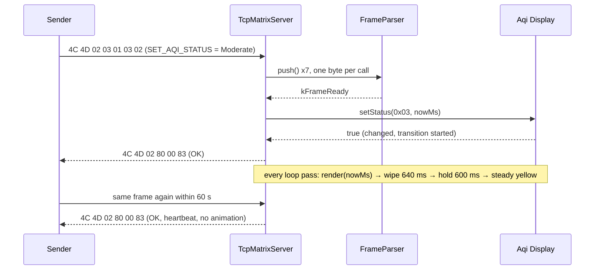

### `Aqi::Display` — the API you'd change

The display core is a pure state machine you can drive with a fake clock, which is exactly what the tests do.

```cpp
namespace Aqi {
class Display {
 public:
  Display();
  void    begin(uint32_t nowMs);                      // enter standby immediately, no transition
  bool    setStatus(uint8_t status, uint32_t nowMs);  // false + no change if status > 0x0C;
                                                      // changed code starts a transition,
                                                      // same code only refreshes the standby timeout
  bool    render(uint32_t nowMs, uint8_t* frame);     // writes 48 bytes (physical order), applies the
                                                      // standby timeout, true if the frame changed
  bool    inStandby() const;
  bool    inTransition() const;
  bool    hasStatus() const;                          // == !inStandby()
  uint8_t currentStatus() const;                      // 0xFF in standby

  static constexpr uint32_t kTransitionWipeMs =
      AppConfig::kAqiTransitionWipeStepMs * AppConfig::kLedCount;      // 40 * 16 = 640
  static constexpr uint32_t kTransitionTotalMs =
      kTransitionWipeMs + AppConfig::kAqiTransitionHoldMs;             // 640 + 600 = 1240
};
}
```

Design rules baked into it:

- **Time is injected**, never read. `nowMs` comes from the caller — there is no `millis()` inside — which is why the whole animation engine runs under Unity on the host with a fake clock.
- **`render()` is deterministic in `nowMs`** and reports whether the frame changed, so `updateDisplay()` skips identical NeoPixel pushes.
- **`setStatus()` is the only input.** A changed code starts a transition; the same code (outside standby) is a heartbeat that only refreshes the timeout; the first code after standby always animates, even if it equals the last one shown.
- **The standby timeout lives inside `render()`**, measured from the last accepted `SET_AQI_STATUS`. `PING` does not refresh it — only a status does.
- **Colour is chosen before brightness.** `kVisuals` stores full-range RGB; breathing scales it; `LedMatrixController::setBrightness` re-renders from its stored `frameRgb_` so NeoPixel's lossy `setBrightness` never degrades colours.

Patterns are the `Pattern` enum in `AqiDisplay.h`: `kStatic`, `kBreathing`, `kBlink`, `kInner`, `kDualZone`, `kAlternate`. Enum names for the statuses (`MatrixProtocol.h`): `kExcellent`, `kGood`, `kGoodDegrading`, `kModerate`, `kModerateDegrading`, `kPoor`, `kPoorDegrading`, `kUnhealthy`, `kUnhealthyDegrading`, `kVeryUnhealthy`, `kVeryUnhealthyDeg`, `kHazardous`, `kExtreme`.

### Adding or changing a state

1. Add the enum value in `MatrixProtocol.h` (`AqiStatus`) and bump **both** `MatrixProtocol::kAqiStatusCount` (`MatrixProtocol.h`) and `Aqi::kStatusCount` (`AqiDisplay.h`). They are separate constants with no `static_assert` tying them together: `kVisuals` is sized by the second, `setStatus()` range-checks against it, and `test_aqi`'s "exactly 13 statuses" test is the only thing that catches a mismatch.
2. Add a row to `kVisuals` in `AqiDisplay.cpp` (pattern, primary, secondary).
3. Add the name to **both** `tools/client.py` and `tools/aqi_example.py` (each has its own table), and the normative row to `docs/protocol.md`.
4. Update `test/test_aqi` — the "exactly 13 statuses" and "every status visually unique" tests will fail until you do, which is the point.
5. Update the visible contract: the state table and `AQI states` badge in this README, `docs/assets/states.svg`, and the `host tests` badge if you added tests.

Adding a *pattern* is one enum value, one branch in the steady-state renderer, one row per state in `kVisuals`, and a test in `test_aqi`.

### Adding a command

1. Add the id to `MatrixProtocol::Command` in `MatrixProtocol.h`.
2. Add a `case` in `TcpMatrixServer::applyCommand()` (`src/TcpMatrixServer.cpp`) — validate `length` first and return `kInvalidLength`, then range-check the payload and return `kInvalidArgument`; only then touch `matrix_` or `display_`.
3. Add the name to `commandName()` in the same file so the serial `Instruction:` line stops saying `UNKNOWN`.
4. Add a subcommand to `tools/client.py` (a `cmd_*` function plus a `sub.add_parser` entry) and a section to `docs/protocol.md`.
5. Add a `test_protocol` case that feeds the new frame byte-by-byte and asserts `kFrameReady` with the right `command()` / `payloadLength()`; the dispatch itself is hardware-bound and is verified via the serial log. Bump the `host tests` badge.

The parser is command-agnostic — it never rejects an id — so `UNKNOWN_COMMAND` comes from `applyCommand()`'s `default`, not from `FrameParser`.

---

## 🧪 Testing

The protocol and display cores are compiled for your host with [Unity](https://github.com/ThrowTheSwitch/Unity) and exercised with an injected clock. No board, no serial port, no mocking framework.

The `native` env uses whatever `g++` / `clang++` is on your `PATH` (any C++17 compiler; PlatformIO does not download one for `platform = native`). On Debian/Ubuntu that is `sudo apt install build-essential`, on macOS the Xcode command-line tools, on Windows MinGW-w64 or MSVC in a developer shell.

```bash
pio test -e native     # 3 suites, 39 tests, seconds
pio check              # cppcheck (warning, style, performance, portability) on esp32dev
```

<details>
<summary><b><code>test/test_protocol</code> — 12 tests</b></summary>
<br>

XOR checksum · response frame well-formed (6 bytes, `0x80`) · parse `PING` · parse a frame with payload byte-by-byte (`kNeedMore` until the last byte) · max 255-byte payload / 261-byte frame · pipelined frames with reset · byte after a ready frame starts a new frame without an explicit reset · bad first magic byte reports an error and resyncs · bad second magic byte resets · wrong version rejected · checksum mismatch rejected and resets · `reset()` discards a partial frame.
</details>

<details>
<summary><b><code>test/test_aqi</code> — 20 tests</b></summary>
<br>

Serpentine layout mapping (`(0,1)→7`, `(3,1)→4`, `(0,3)→15`, out-of-range → 16) · exactly 13 statuses (13, `0x7F`, `0xFF` rejected) · patterns match the spec · colour bands (green 0–2, yellow 3–4, `0x04` inner = orange of `0x05`, orange 5–6, red 7–8, purple 9–`0x0C`, extreme's secondary is a distinct red) · every status visually unique · boots into standby breathing (blue-dominant) · invalid status rejected and ignored · `render()` reports unchanged frames · status change starts the wipe from top-right over the previous frame (8 px painted after 7 steps) · transition holds solid then settles (inner 2×2 for `0x00`) · same status = heartbeat, no transition · change mid-transition restarts from the current frame · static pattern constant · breathing cycles, never dark, period 16 steps, max below static · blink toggles at 500 ms · alternate swaps colours at 300 ms · dual-zone static perimeter + breathing centre · stale data → standby with transition at exactly 60 s from the last status · heartbeat refreshes the standby timeout · first status after standby transitions again.
</details>

<details>
<summary><b><code>test/test_discovery</code> — 7 tests</b></summary>
<br>

Payload matches the documented JSON byte-for-byte · default-style `neoncore-xxxxxx` name fits · quotes, backslashes and control characters in strings are escaped · null strings become `""` · too-small buffer, zero capacity and null output are rejected with `-1` · exact-fit boundary (capacity `n` fails, `n + 1` succeeds) · numeric fields use their full range (`port` 65535, `uptime_s` 2³²−1, `protocol` 255).
</details>

### Test strategy for changes

| You are changing… | Write the test in… | Pattern |
|:--|:--|:--|
| Frame format, a new command id, parser recovery | `test_protocol` | Feed bytes one at a time through `FrameParser::push()`, assert `kNeedMore` / `kFrameReady` / `kError` and the resulting `Status`. |
| A colour, pattern, timing constant | `test_aqi` | Construct `Aqi::Display`, call `begin(0)`, `setStatus(code, t)`, then `render(t, frame)` at chosen instants; assert on the 48-byte frame via `MatrixLayout::logicalToPhysical`. |
| A field in the registration JSON | `test_discovery` | Build an `Info`, call `buildPayload()`, assert the exact string. Update the documented body in this README and `docs/protocol.md` in the same commit. |
| Wi-Fi, sockets, NeoPixel, the discovery HTTP task | — | Not host-testable today; verify on hardware with the serial log lines listed under [Quick start](#-quick-start). Keep such changes small and behind the existing method boundaries in `TcpMatrixServer`. |

Timing tests use the constants from `AppConfig.h` rather than literals where possible, so retuning a knob does not silently break a test — but if you change a *shape* (table length, wipe order) the tests will and should fail.

### Build environments

| Env | Platform | Notes |
|:--|:--|:--|
| `esp32dev` (default) | `espressif32` · Arduino · `monitor_speed = 115200` | `lib_deps = adafruit/Adafruit NeoPixel@^1.15.5` · `check_tool = cppcheck` |
| `native` | host · Unity | `build_src_filter = +<MatrixProtocol.cpp> +<AqiDisplay.cpp> +<DiscoveryPayload.cpp>` · `-std=c++17 -Wall -Wextra` · needs a host C++17 compiler on `PATH` |

The `native` env compiles only those three sources. **If you add a hardware-free source file, add it to that filter.**

---

## 🗂 Project structure

```
neoncore/
├── platformio.ini              # esp32dev (default) + native test env
├── .gitignore                  # ignores .pio, include/creds.h
├── LICENSE                     # MIT
├── README.md
├── include/
│   ├── AppConfig.h             # all tunables (constexpr), pulls in creds.h
│   ├── creds.example.h         # copy to creds.h (git-ignored)
│   ├── MatrixProtocol.h        # wire contract: enums, constants, FrameParser   [hardware-free]
│   ├── AqiDisplay.h            # visual contract: Aqi::Display                 [hardware-free]
│   ├── MatrixLayout.h          # serpentine mapping (header-only)              [hardware-free]
│   ├── DiscoveryPayload.h      # registration JSON builder                     [hardware-free]
│   ├── DiscoveryClient.h       # registry registration (FreeRTOS task + HTTP)
│   ├── LedMatrixController.h   # NeoPixel wrapper
│   └── TcpMatrixServer.h       # Wi-Fi + TCP + dispatch
├── src/
│   ├── main.cpp                # setup()/loop(), startup sweep
│   ├── MatrixProtocol.cpp
│   ├── AqiDisplay.cpp          # kVisuals table, breathing table, wipe order, renderer
│   ├── DiscoveryPayload.cpp
│   ├── DiscoveryClient.cpp     # no-op unless DISCOVERY_URL is defined
│   ├── LedMatrixController.cpp
│   └── TcpMatrixServer.cpp
├── test/
│   ├── test_protocol/test_main.cpp   # 12 Unity tests
│   ├── test_aqi/test_main.cpp        # 20 Unity tests
│   └── test_discovery/test_main.cpp  #  7 Unity tests
├── tools/
│   ├── client.py               # one-shot CLI: ping / brightness / panel / aqi, exit codes 0/1/2
│   ├── aqi_example.py          # persistent-connection tour of all 13 states
│   └── discovery_server.py     # reference registry: POST /register, GET /devices
├── docs/
│   ├── protocol.md             # normative protocol spec
│   └── assets/                 # hero, states, transition, wiring, frame (SVG)
└── .vscode/extensions.json     # recommends platformio.platformio-ide
```

---

## 🎚 Tuning knobs

Everything below is a `constexpr` in `include/AppConfig.h`. Change the number, rebuild, flash.

| Constant | Default | Why you might change it |
|:--|:--|:--|
| `kDefaultBrightness` | `40` | Brighter room, or a diffuser that eats light. `SET_BRIGHTNESS` overrides at runtime but isn't persisted. Remember the > 900 mA warning. |
| `kAqiStandbyTimeoutMs` | `60000` | Your sender polls less often than once a minute. Match it to the poll interval × 2–3. |
| `kClientIdleTimeoutMs` | `90000` | Persistent-connection senders that ping rarely. Keep it above the standby timeout. |
| `kAqiBreathingStepMs` | `80` | Slower/faster breath (16 steps × this = 1.28 s cycle). |
| `kAqiBlinkIntervalMs` · `kAqiAlternateIntervalMs` | `500` · `300` | How alarming Hazardous / Extreme feel. |
| `kAqiTransitionWipeStepMs` · `kAqiTransitionHoldMs` | `40` · `600` | Snappier or more theatrical status changes. Wipe total = step × 16. |
| `kWifiRetryIntervalMs` | `15000` | Flaky AP. |
| `kTcpKeepAliveIdleSec` / `IntervalSec` / `Count` | `10` / `5` / `3` | Faster dead-peer detection (≈ idle + interval × count) at the cost of chatter. |
| `kFrameTimeoutMs` | `2000` | Very slow or very bursty senders. |
| `kDiscoveryRefreshIntervalMs` · `kDiscoveryRetryIntervalMs` | `300000` · `30000` | How often a registered device re-announces, and how fast it retries a dead registry. Keep refresh below the registry's TTL (15 min on the reference server). |
| `kDiscoveryHttpTimeoutMs` | `5000` | Connect/read timeout for the registration POST. Only the worker task waits on it. |
| `kMaxClientBytesPerLoop` | `256` | Bulk-command senders (rarely needed — contract frames are 6–7 bytes). |
| `kBootSettleDelayMs` | `2000` | Shorter boot if your supply is solid. |
| `kDisableBrownoutDetector` | `true` | Set `false` on a good supply to get resets instead of corruption. |
| `kTcpPort` · `kAccessPointSsid` | `7777` · `"led-matrix"` | Port collisions; a friendlier bench SSID. |
| `kScanNetworksOnBoot` | from `WIFI_SCAN_ON_BOOT` | Debugging Wi-Fi. |

Changing the transition timings automatically updates `Aqi::Display::kTransitionWipeMs` / `kTransitionTotalMs` (they are derived) and the tests that depend on them.

Things that are *not* knobs (yet): the colour table and breathing curve live in `src/AqiDisplay.cpp` (`kVisuals`, the 16-entry table), and so does the wipe order (`kWipeX` / `kWipeY`). The matrix size (`kMatrixWidth` / `kMatrixHeight` / `kLedCount`) is 4×4 by contract: the patterns (inner 2×2, perimeter, the 16-LED wipe order) are written for it.

---

## 🛣 Roadmap & contributing

Small, deliberate scope; contributions that keep it that way are very welcome.

- [ ] Persist brightness across reboots (NVS)
- [ ] Parser resync on a bad second magic byte (treat it as a candidate magic 0) — with a `test_protocol` case
- [ ] Optional AP fallback after N failed station retries, for field provisioning
- [ ] Reference sender for the AirGradient ONE local API as a separate repo, so this one stays sensor-agnostic

**Before opening a PR:** `pio test -e native` must be green and `pio check` clean. If you touch the protocol or the visuals, update `docs/protocol.md`, both tools and the tests in the same commit — the docs are normative and the tests are how the contract is enforced. Any new visual state must remain distinguishable from every existing one (there is a test for that). If you touched `TcpMatrixServer` or `LedMatrixController`, paste the relevant serial log from real hardware in the PR.

---

## 🔒 Security model

Short version: **it's a lamp on your LAN.** Protocol v2 has **no authentication and no encryption**; the XOR checksum catches line noise, not adversaries. The threat model is *"a device on my home LAN that changes the colour of sixteen LEDs"*.

- Anyone who can reach port 7777 can set the display, change brightness or blank it. They cannot do anything else — there is no command that writes flash, reboots, or reads configuration. None of the writable state persists.
- Keep neoncore on a trusted LAN or IoT VLAN. **Do not port-forward 7777.** If you want remote control, put the sender on the LAN and reach *it* securely.
- Wi-Fi credentials live in the git-ignored `include/creds.h` and in the compiled binary; `WiFi.persistent(false)` keeps them out of the ESP32's Wi-Fi flash storage.
- Discovery, when enabled, tells the registry the device's LAN IP and MAC over plain HTTP by default. `DISCOVERY_TOKEN` stops random hosts from registering fake devices with your registry; it does not hide the payload from anyone sniffing the LAN. HTTPS is available but skips certificate validation.
- Open-AP mode (`WIFI_SSID` empty, no `WIFI_AP_PASSWORD`) is for the bench, not the shelf.
- The 256-byte per-loop read budget exists to keep animations smooth, not to throttle attackers.

---

## 📄 License

[MIT](LICENSE). Build one, sell one, fork one — just keep the notice.

---

## 🙏 Credits

- [AirGradient](https://www.airgradient.com/) — the ONE monitor this display was built to accompany, and whose LED bar inspired the wipe direction.
- [Adafruit NeoPixel](https://github.com/adafruit/Adafruit_NeoPixel) — the WS2812B driver underneath `LedMatrixController`.
- [PlatformIO](https://platformio.org/) — build, upload, monitor, host tests and cppcheck in one tool.
- [Unity](https://github.com/ThrowTheSwitch/Unity) — the test framework behind the 39 tests.

<p align="center">
  <sub>Built by <a href="https://github.com/w0rxbend">w0rxbend</a>. neoncore · ESP32 · 4×4 WS2812B · protocol v2 · port 7777. Sixteen pixels, one byte, no excuses.</sub>
</p>
